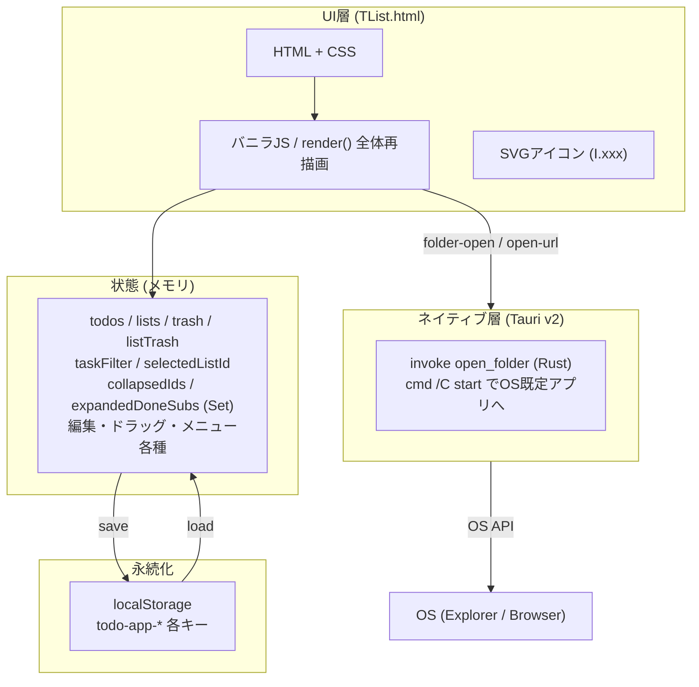
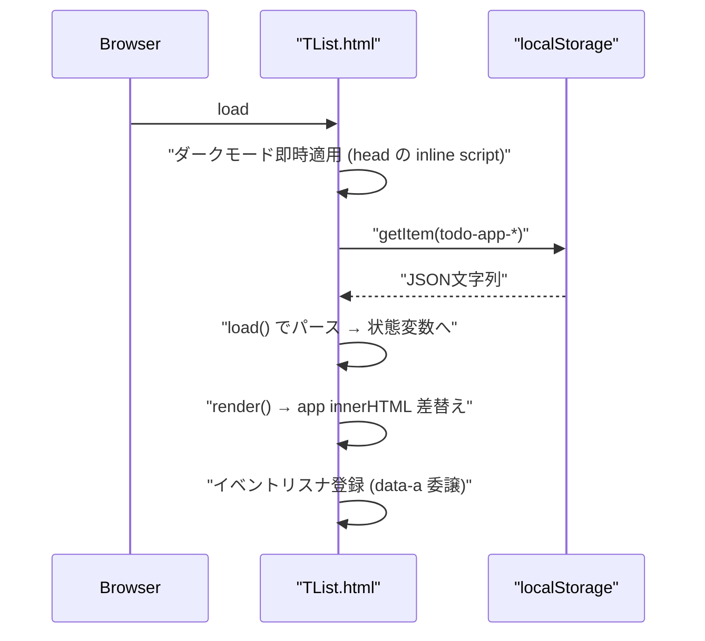
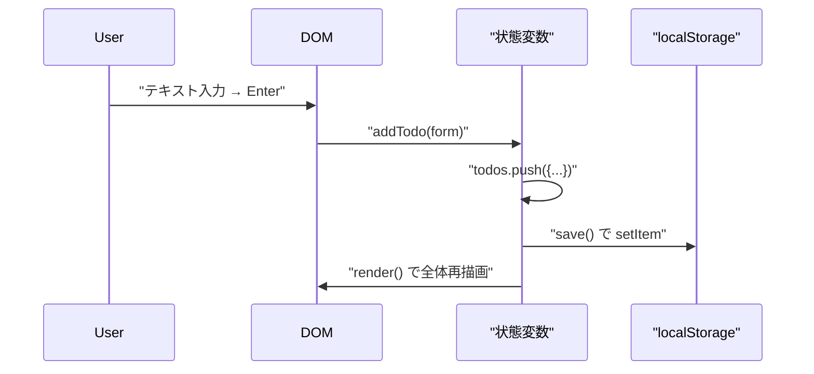

# 01-2 全体アーキテクチャ

## 一枚絵



## 各層の役割

| 層 | 役割 | 主な実装箇所 |
|---|---|---|
| UI層 | DOM生成・イベント受付 | `TList.html` `html()`, `render()`, `htmlSidebar()`, `htmlMain()`, `htmlMemoPopup()`, `htmlMovePopup()`, `htmlCtxMenu()` ほか |
| 状態 | メモリ上のグローバル変数群 | `TList.html` スクリプト先頭部（`let todos / lists / trash / 各種編集・UI 状態 / Set 系`） |
| 永続化 | `localStorage` への保存・読込 | `TList.html` `load()`, `save()` |
| 周期処理 | 繰り返しタスクの周期境界リセット | `TList.html` `applyRecurringResets()`（`render()` 冒頭で実行） |
| ネイティブ層 | フォルダ／URLをOS既定アプリで開く | `tauri/src-tauri/src/main.rs` |

## 起動シーケンス（Web）



## 主要操作シーケンス（タスク追加）



## ディレクトリ構成

```
タスク管理アプリ/
├── TList.html                ← 本体（単一HTML、全ロジック）
├── app.html                  ← TList.html へのリダイレクト（後方互換）
├── index.html                ← TList.html へのリダイレクト
├── README.md                 ← エンドユーザー向け概要
├── HANDOFF.md                ← 網羅的引継ぎドキュメント
├── docs/                     ← 本ドキュメント
└── tauri/
    ├── package.json          ← @tauri-apps/cli v2 / sync-html
    ├── dist/index.html       ← TList.html のコピー（自動同期）
    └── src-tauri/
        ├── tauri.conf.json   ← withGlobalTauri / dragDropEnabled:false
        ├── Cargo.toml        ← tauri v2, serde
        ├── capabilities/     ← core:default
        ├── icons/            ← tauri icon 生成済み
        └── src/main.rs       ← open_folder コマンド
```

> 旧 `electron/` / `photino/` ディレクトリは Tauri 一本化に伴い削除済み。

## 技術スタック

| レイヤ | 技術 | バージョン |
|---|---|---|
| 言語 | JavaScript ES6+ / HTML5 / CSS3 | - |
| ストレージ | Web Storage API (localStorage) | - |
| ネイティブ | Tauri | v2 (`@tauri-apps/cli` v2、Rust + WebView2) |
| 配布形態 | Web (GitHub Pages) / NSIS インストーラ | - |

## なぜこの構成か

- **単一HTML**: ファイルを開くだけで動く・配布が容易・依存ゼロ
- **Tauri 採用**: 検証の結果、配布サイズ（~10MB）と使い勝手の双方が良好だったため、旧 Electron / Photino から Tauri 一本化を実施（旧3方式比較は [HANDOFF.md](../../HANDOFF.md) 履歴に記載）
- **localStorage 永続化**: サーバ不要、端末ローカル完結

## 次に読むべき章

- [04-1 フロントエンド構造](../04_実装詳細/04-1_フロントエンド構造.md)
- [04-2 データモデルと永続化](../04_実装詳細/04-2_データモデルと永続化.md)
- [03-2 ネイティブパッケージング](../03_開発とビルド/03-2_ネイティブパッケージング.md)
