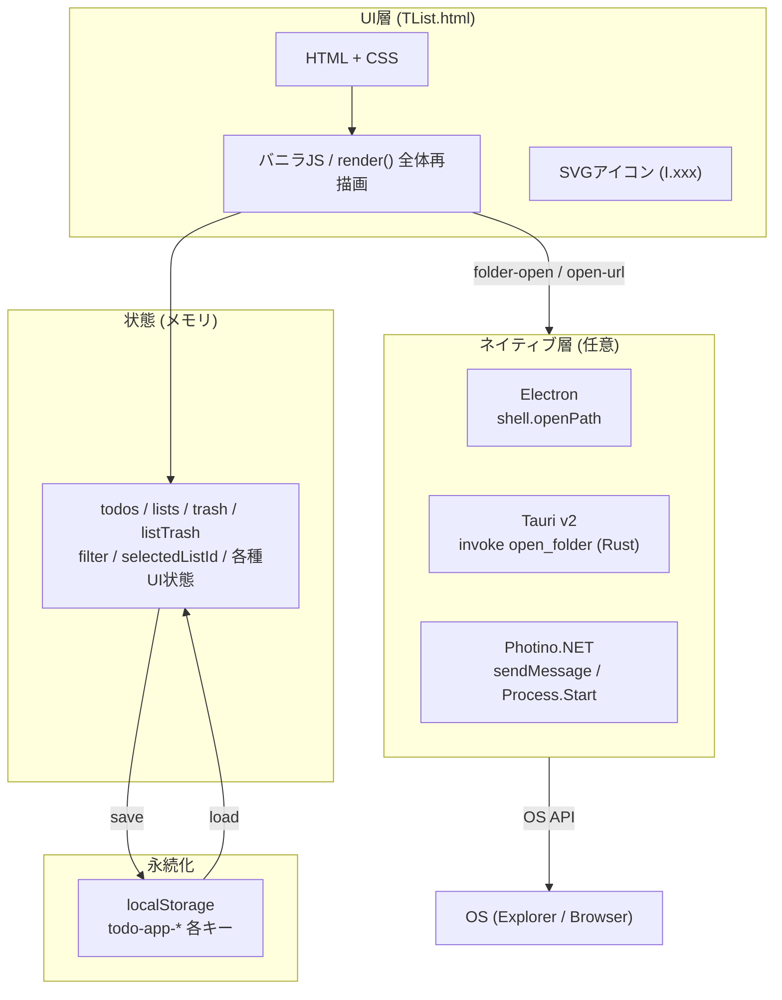
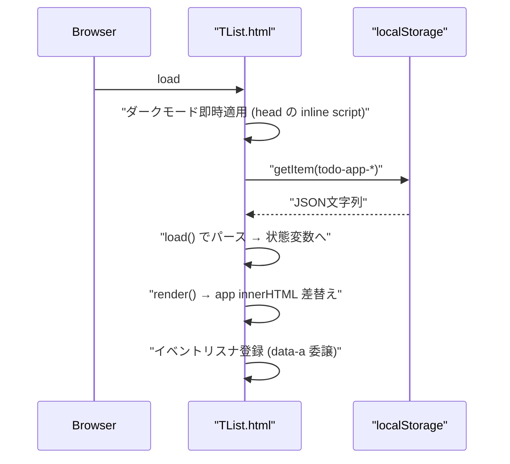
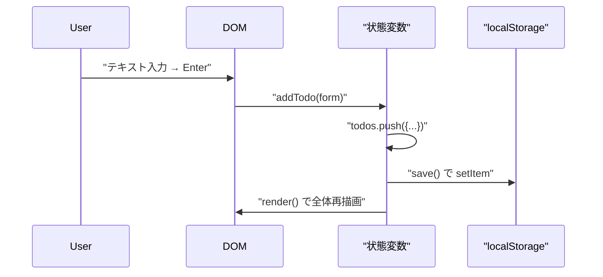

# 01-2 全体アーキテクチャ

## 一枚絵



## 各層の役割

| 層 | 役割 | 主な実装箇所 |
|---|---|---|
| UI層 | DOM生成・イベント受付 | `TList.html` `html()`, `render()`, `htmlSidebar()`, `htmlMain()` |
| 状態 | メモリ上のグローバル変数群 | `TList.html` 922-939行 |
| 永続化 | `localStorage` への保存・読込 | `TList.html` `load()`, `save()`（942-964行） |
| ネイティブ層 | フォルダ／URLをOS既定アプリで開く | `electron/main.js` / `tauri/src-tauri/src/main.rs` / `photino/Program.cs` |

## 起動シーケンス（Web）



## 主要操作シーケンス（タスク追加）



## ディレクトリ構成

```
タスク管理アプリ/
├── TList.html                ← 本体（単一HTML、全ロジック）
├── app.html                  ← TList.html へのリダイレクト（後方互換）
├── index.html                ← TList.html へのリダイレクト
├── README.md                 ← エンドユーザー向け概要
├── HANDOFF.md                ← 網羅的引継ぎドキュメント
├── docs/                     ← 本ドキュメント
├── electron/
│   ├── main.js               ← Electronメインプロセス
│   ├── preload.js            ← contextBridge 経由の API 公開
│   ├── package.json          ← electron v35 / electron-builder v25
│   └── build.bat             ← ビルドヘルパー
├── tauri/
│   ├── package.json          ← @tauri-apps/cli v2 / sync-html
│   ├── dist/index.html       ← TList.html のコピー（自動同期）
│   └── src-tauri/
│       ├── tauri.conf.json   ← withGlobalTauri / dragDropEnabled:false
│       ├── Cargo.toml        ← tauri v2, serde
│       ├── capabilities/     ← core:default
│       ├── icons/            ← tauri icon 生成済み
│       └── src/main.rs       ← open_folder コマンド
└── photino/
    ├── Program.cs            ← PhotinoWindow + メッセージハンドラ
    ├── TList.csproj          ← Photino.NET 4.* / .NET 9.0 / SingleFile
    └── icon.ico              ← Tauri と共通
```

## 技術スタック

| レイヤ | 技術 | バージョン |
|---|---|---|
| 言語 | JavaScript ES6+ / HTML5 / CSS3 | - |
| ストレージ | Web Storage API (localStorage) | - |
| ネイティブ A | Electron | v35 + electron-builder v25 |
| ネイティブ B | Tauri | v2 (`@tauri-apps/cli` v2) |
| ネイティブ C | Photino.NET | v4.* (.NET 9.0) |
| 配布形態 | Web (GitHub Pages) / NSIS / 単一exe | - |

## なぜこの構成か

- **単一HTML**: ファイルを開くだけで動く・配布が容易・依存ゼロ
- **3方式並走**: 配布サイズと開発容易性のトレードオフを比較中（Electron 150MB+ / Tauri 3〜10MB / Photino 15〜30MB の見込み、[HANDOFF.md](../../HANDOFF.md)）
- **localStorage 永続化**: サーバ不要、端末ローカル完結

## 次に読むべき章

- [04-1 フロントエンド構造](../04_実装詳細/04-1_フロントエンド構造.md)
- [04-2 データモデルと永続化](../04_実装詳細/04-2_データモデルと永続化.md)
- [03-2 ネイティブパッケージング](../03_開発とビルド/03-2_ネイティブパッケージング.md)
