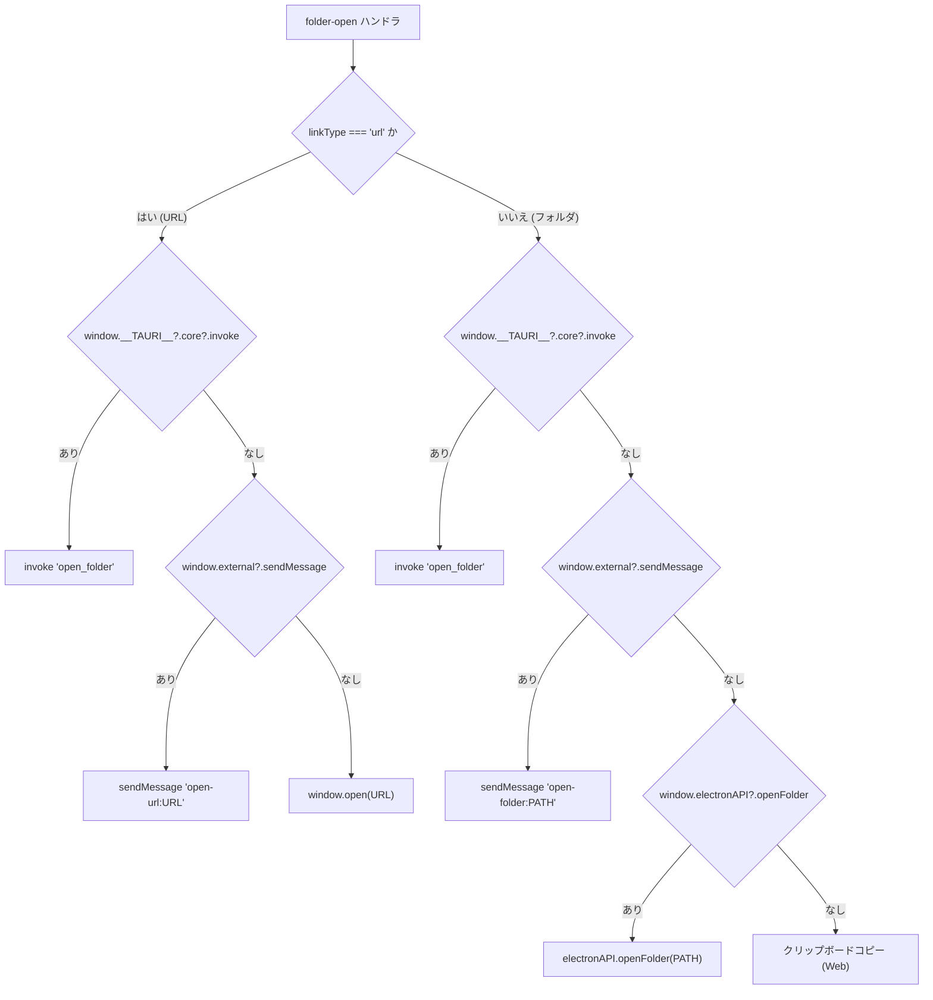

# 04-3 ネイティブ環境連携

タスクに紐付いた **フォルダパス／URL を OS の既定アプリで開く** 処理を、Web／Electron／Tauri／Photino の4環境で動かすための分岐です。

## 環境判定の優先順



判定の優先順（[HANDOFF.md](../../HANDOFF.md)「ネイティブ環境のフォルダ/URL開く処理」に準拠）:

```
URL    → Tauri → Photino → window.open()
フォルダ → Tauri → Photino → Electron → クリップボードコピー（Web）
```

## 判定コード

[TList.html:1886-1928](../../TList.html) 抜粋。

```javascript
if (ft.linkType === 'url') {
  if (window.__TAURI__?.core?.invoke) {
    window.__TAURI__.core.invoke('open_folder', { path: url })
      .then(...).catch(...);
  } else if (window.external?.sendMessage) {
    window.external.sendMessage('open-url:' + url);
  } else {
    window.open(url, '_blank');
  }
} else {
  if (window.__TAURI__?.core?.invoke) {
    window.__TAURI__.core.invoke('open_folder', { path: ft.folderPath })
      .then(...).catch(...);
  } else if (window.external?.sendMessage) {
    window.external.sendMessage('open-folder:' + ft.folderPath);
  } else if (window.electronAPI?.openFolder) {
    window.electronAPI.openFolder(ft.folderPath).then(res => { ... });
  } else {
    // クリップボードへコピー
  }
}
```

> URLの場合は Electron 分岐を経由せず `window.open()` に落ちる点に注意（Electron 内のブラウザで普通に開ける）。

## Tauri 側

`tauri/src-tauri/src/main.rs` の `open_folder` コマンド。Windows では `cmd /C start "" <path>` を `CREATE_NO_WINDOW` フラグ付きで起動（コンソール一瞬表示を抑制）。

```rust
#[tauri::command]
fn open_folder(path: String) -> Result<(), String> {
    Command::new("cmd")
        .args(["/C", "start", "", &path])
        .creation_flags(CREATE_NO_WINDOW)
        .spawn()
        .map_err(|e| e.to_string())?;
    Ok(())
}
```

`tauri.conf.json` の `app.withGlobalTauri: true` により `window.__TAURI__` がブラウザJSから直接見えます。

## Photino 側

`photino/Program.cs`。

- JS → C#: `window.external.sendMessage('open-folder:<path>')` または `'open-url:<url>'`
- C# 側で `Process.Start(new ProcessStartInfo { FileName, UseShellExecute = true })` を実行
- C# → JS: `window.SendWebMessage('folder-result:success')` 等

JS側でC#からの応答を受信するレシーバが、`TList.html` の Init セクション直前に登録されています（[TList.html:2346](../../TList.html)）。

```javascript
if (window.external?.receiveMessage) {
  window.external.receiveMessage((msg) => {
    // 'folder-result:success' / 'folder-result:error:...' 等を解析しトースト表示
  });
}
```

## Electron 側

`electron/preload.js` で contextBridge 経由に API を公開。

```javascript
contextBridge.exposeInMainWorld('electronAPI', {
  openFolder: (folderPath) => ipcRenderer.invoke('open-folder', folderPath),
});
```

メインプロセス側 `electron/main.js`:

```javascript
ipcMain.handle('open-folder', async (_event, folderPath) => {
  const errMsg = await shell.openPath(folderPath);
  return { success: errMsg === '', error: errMsg };
});
```

`shell.openPath` は成功時に空文字列を返す仕様。

## Web フォールバック

ネイティブ機能が一切無い場合、フォルダパスはOSの制約上ブラウザから直接開けないため、**クリップボードにコピー** してエクスプローラに貼り付けてもらう挙動になります。

## 環境ごとの差異まとめ

| 環境 | URL を開く | フォルダを開く |
|---|---|---|
| Web | `window.open` | クリップボードコピー |
| Electron | `window.open`（既定ブラウザ／同ウインドウ判定） | `shell.openPath` |
| Tauri | Rust `cmd /C start` | Rust `cmd /C start` |
| Photino | C# `Process.Start` | C# `Process.Start` |

## 次に読むべき章

- [02-4 メモとリンク](../02_機能ガイド/02-4_メモとリンク.md)
- [03-2 ネイティブパッケージング](../03_開発とビルド/03-2_ネイティブパッケージング.md)
- [05-2 既知の制約とハマりどころ](../05_リファレンス/05-2_既知の制約とハマりどころ.md)
