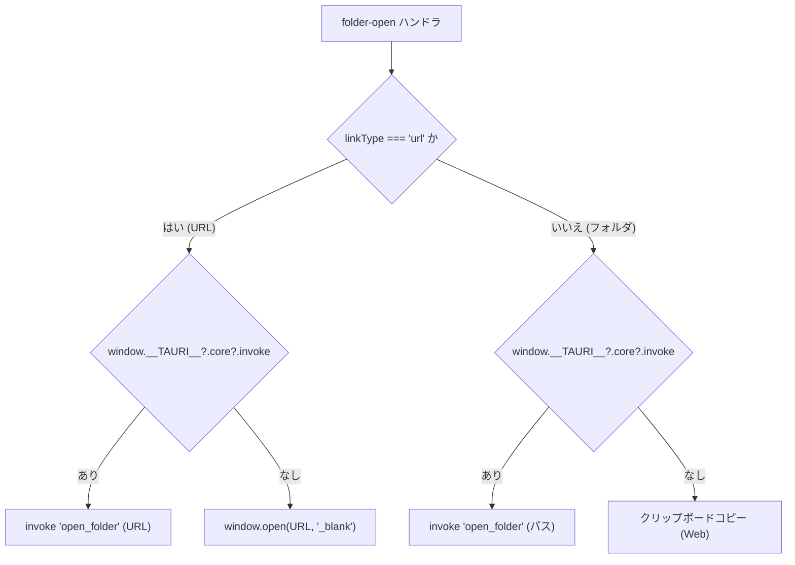

# 04-3 ネイティブ環境連携

タスクに紐付いた **フォルダパス／URL を OS の既定アプリで開く** 処理を、Web と Tauri の2環境で動かすための分岐です。Tauri 一本化に伴い、旧 Electron / Photino 対応は撤廃済み。

## 環境判定の優先順



判定の優先順:

```
URL    → Tauri → window.open()
フォルダ → Tauri → クリップボードコピー（Web）
```

## 判定コード（`TList.html` の `folder-open` ハンドラ抜粋）

```javascript
if (ft.linkType === 'url') {
  let url = ft.folderPath;
  if (!/^https?:\/\//i.test(url)) url = 'https://' + url;
  if (window.__TAURI__?.core?.invoke) {
    window.__TAURI__.core.invoke('open_folder', { path: url })
      .then(() => showToast('🔗 URLを開きました'))
      .catch(() => showToast('⚠️ URLを開けませんでした'));
    break;
  }
  // Web フォールバック
  window.open(url, '_blank');
  showToast('🔗 URLを開きました');
  break;
}

// フォルダの場合
if (window.__TAURI__?.core?.invoke) {
  window.__TAURI__.core.invoke('open_folder', { path: ft.folderPath })
    .then(() => showToast('📁 フォルダを開きました'))
    .catch(() => {
      showToast('📋 パスをクリップボードにコピーしました');
      navigator.clipboard.writeText(ft.folderPath).catch(() => {});
    });
  break;
}

// Web フォールバック: クリップボードへコピー
navigator.clipboard.writeText(ft.folderPath)
  .then(() => showToast('📋 パスをクリップボードにコピーしました'));
```

> URL の場合は Tauri も `open_folder` コマンドを共用し、`cmd /C start` で OS 既定ブラウザ／既定アプリへ渡します。

## Tauri 側（`src-tauri/src/main.rs`）

`open_folder` コマンドは URL/フォルダ/ファイルパスのいずれにも対応。Windows では `cmd /C start "" <path>` を `CREATE_NO_WINDOW` フラグ付きで起動（コンソール一瞬表示を抑制）。

```rust
#[tauri::command]
fn open_folder(path: String) -> Result<(), String> {
    Command::new("cmd")
        .args(["/C", "start", "", &path])
        .creation_flags(CREATE_NO_WINDOW)
        .spawn()
        .map_err(|e| e.to_string())?;
    Ok(())
}
```

`tauri.conf.json` の `app.withGlobalTauri: true` により `window.__TAURI__` がブラウザJSから直接見えます。

## Web フォールバック

Tauri が無い場合（ブラウザでアクセスした場合）:

- **URL**: `window.open(url, '_blank')` で別タブ
- **フォルダ**: OSの制約上ブラウザから直接開けないため、**クリップボードにコピー** してエクスプローラに貼り付けてもらう挙動

## 環境ごとの差異まとめ

| 環境 | URL を開く | フォルダを開く |
|---|---|---|
| Web | `window.open` | クリップボードコピー |
| Tauri | Rust `cmd /C start` | Rust `cmd /C start` |

## 次に読むべき章

- [02-4 メモとリンク](../02_機能ガイド/02-4_メモとリンク.md)
- [03-2 Tauri パッケージング](../03_開発とビルド/03-2_ネイティブパッケージング.md)
- [05-2 既知の制約とハマりどころ](../05_リファレンス/05-2_既知の制約とハマりどころ.md)
